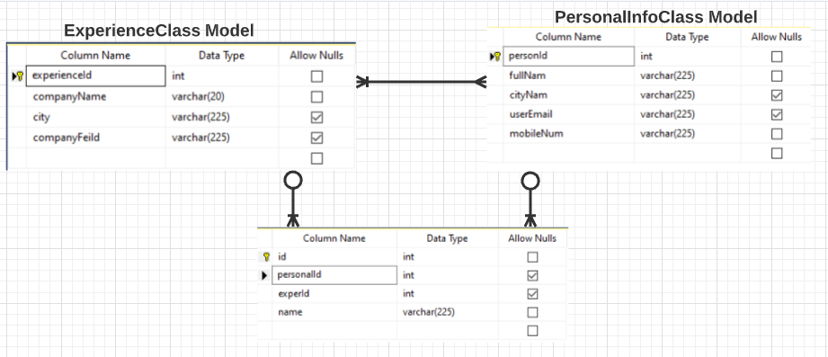

# CV Maker App 
## Auther : Ghofran Dayyat

## Summary of CV Maker App 
- Full Stack Application to manage CVs, where the user can view all CVs inside the
system, and Create, Update, Delete 
- The API  Build by ASP .NET CORE Framework with c#
- UI Design By Angular Framework 
## Links 
- Live Sharing [BackEnd](https://prod.liveshare.vsengsaas.visualstudio.com/join?35301B40F8F1639505BBB4C53B7A2ED6A873) : 
- [FrontEnd](https://github.com/GhofranDayyat/test-gh/tree/main/my-app) : ``Running the App ==>`` ng serve --open

## UML 

